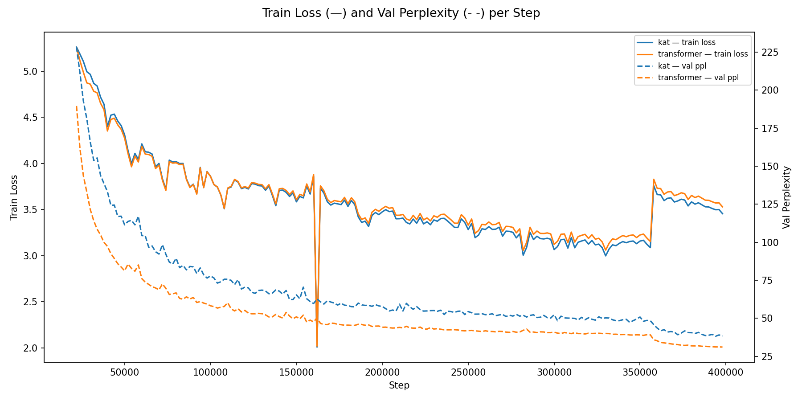

# Description

An ongoaing hobby project exploring post-transformer language model architectures.

# Models implemented

| Status                  | Architecture             |
|-------------------------|--------------------------|
| Implemented             | Transformer, KAT |
| In Implementation       | xLSTM, Mamba (SSM) |
| Planned Implementations | Hyena (H3), RetNet |

If you want to read more about specific models, please check these papers:

| Models | Title |
|--------|-------|
| Transformer | Attention Is All You Need |
| KAT | Kolmogorov-Arnold Transformer |
| Mamba | Mamba: Linear-Time Sequence Modeling with Selective State Spaces |
| xLSTM | xLSTM: Extended Long Short-Term Memory |
| Hyena | Hyena Hierarchy: Towards Larger Convolutional Language Models |
| RetNet | Retentive Network: A Successor to Transformer for Large Language Models | 

# Data & training

The models were trained on wikipedia 2 dataset, tokenized with gpt-2 tokenizer. Tokenized version of the dataset can be found here:
https://huggingface.co/datasets/Maxmartys/tokenized-wiki 

The models were trained online via vast.ai. With NVIDIA RTX 3090 (24 GB, ~35 TFLOPs). New NVIDIA GPUs (like 5090) are incompatible with CUDA version used in this project (11.8). 

### To run the training on vast.ai run following commands in jupyter terminal on pytorch instance:

```shell
curl -s https://raw.githubusercontent.com/MAXMARTYS/my-LLMs/main/vastai_setup/setup.sh
```

### Or you can do that manually using the following commands one by one:

Clone repository and set the directory.

```shell
git clone https://github.com/MAXMARTYS/my-LLMs.git
cd my-LLMs
```

Install uv and set up virtual environment.

```shell
pip3 install uv 
uv sync

source .venv/bin/activate
```

Check cuda availability (optional).

```shell
python -c "
import torch
assert torch.cuda.is_available(), 'CUDA not available!'
print(f'GPU: {torch.cuda.get_device_name(0)}')
"
```

Download dataset from huggingface.

```shell
python -c "
from datasets import load_dataset
import sys
print('Downloading dataset...')
ds = load_dataset('Maxmartys/tokenized-wiki')
ds.save_to_disk('tokenized_wiki')
print(f'Done. {len(ds['train'])} samples saved.')
" || { echo 'Dataset download failed'; exit 1; }
```

Start training. Set MODEL_DIR to any model from the repo.

```shell
MODEL_DIR="transformer"
python3 models/$MODEL_DIR/train.py
```

# Download models

All trained models can be found on my huggingface account:
https://huggingface.co/Maxmartys 

The models will be named following a convention of '{MODEL_NAME}_{PARAM_COUNT}_wikipedia-2'.

# Evaluation

### Training
The training curves and perplexities are shown on the image below. First few steps were skipped for the sake of clarity (For first few thousand steps both losses and perplexities were very high so the rest of the figure would be unclear).


 
### Tests
The samples of generated text for the prompt of 'The capital of France is' (temperature=1.0, max_tokens=100). It is crucial to remember that models this small, without fine-tuning will mostly return factually nonsensical answers. This test allows to check the syntactic understanding of an English language. 

<details>
<summary><b>Transformer</b></summary>

> The capital of France is the capital of the Thérault region of eastern France. It is located between Paris-sur-Marne and Rennes-sur-Marne. The city also includes 49 communes succeeding Châtillon.

Governance
It is a core administrative division between former Thérault communes and French departments of about 50 municipalities. Its capital is the city of Thérault in the Thérault district of Paris. Today is a municipal district of Th

</details>

<details>
<summary><b>KAT</b></summary>

> The capital of France is the province of France.


The capital of France is located in Ville, between the actions of the Minister-Staffour Noué (SP), the corrupt businessman-order of a municipality.

References

Saif
Companies of France
2022 establishments in France
Montreal
Populated places in Ville
Demiety of France
Forts, sites in France
 Bancates, ruins of the city of Pôlvin
Former municipalities of France

</details>
